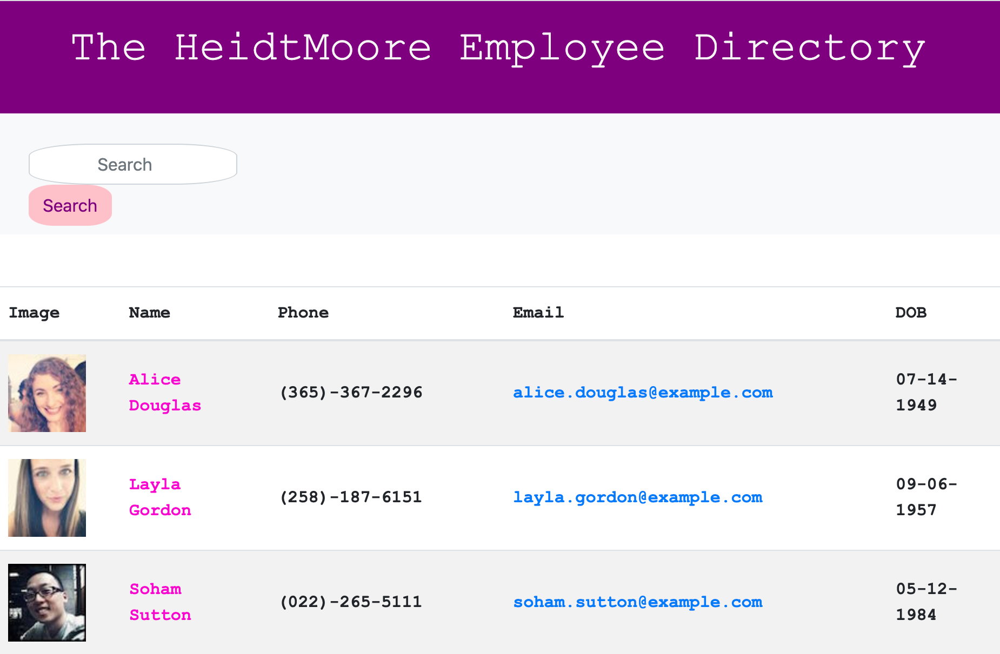
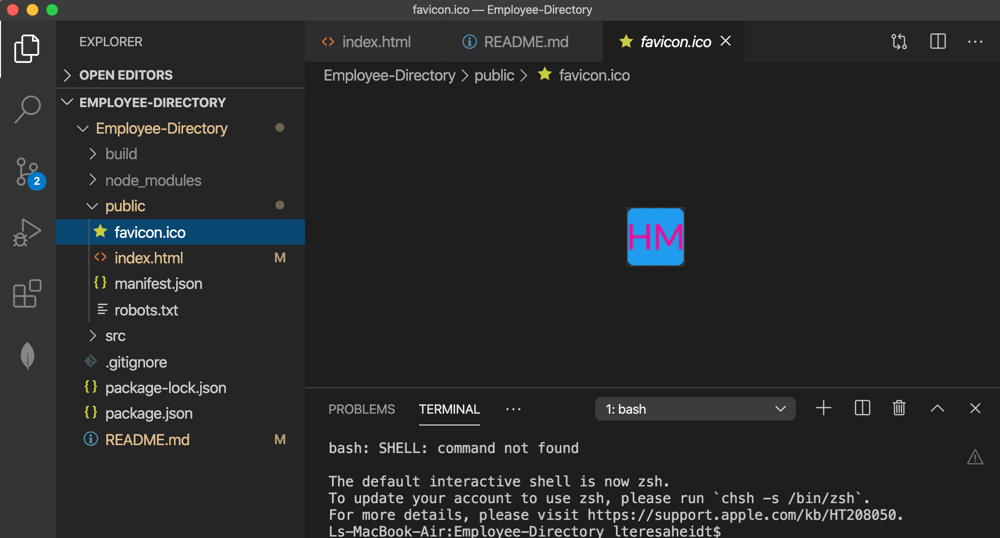

# Employee Directory 🖥

## Index
* About
* How
* Why
* Technologies used
* Images
* Links

## About
When searching for non-sensitive data, the employer can filter employees by name and the name, image, email and date of birth will appear.

## How
First, creating the React app using npx create-react-app and then building the skeleton of the app in App.js. Then the components are built out and each one is imported to the App.js. Every component has a css file to accompany the js file.

## Why
Easy to use search engine built in React. Each component was styled with css.

## Technologies Used
This is a React.js app. The API used is randomuser, which provides the list of random employees.

## Images
This is what the app looks like. I wanted to make it bright and cheerful.

I created a favicon specific to the company.

## Links
[Github repo](https://github.com/teresaheidt/Employee-Directory.git)

[Deployed app](https://teresaheidt.github.io/Employee-Directory/)